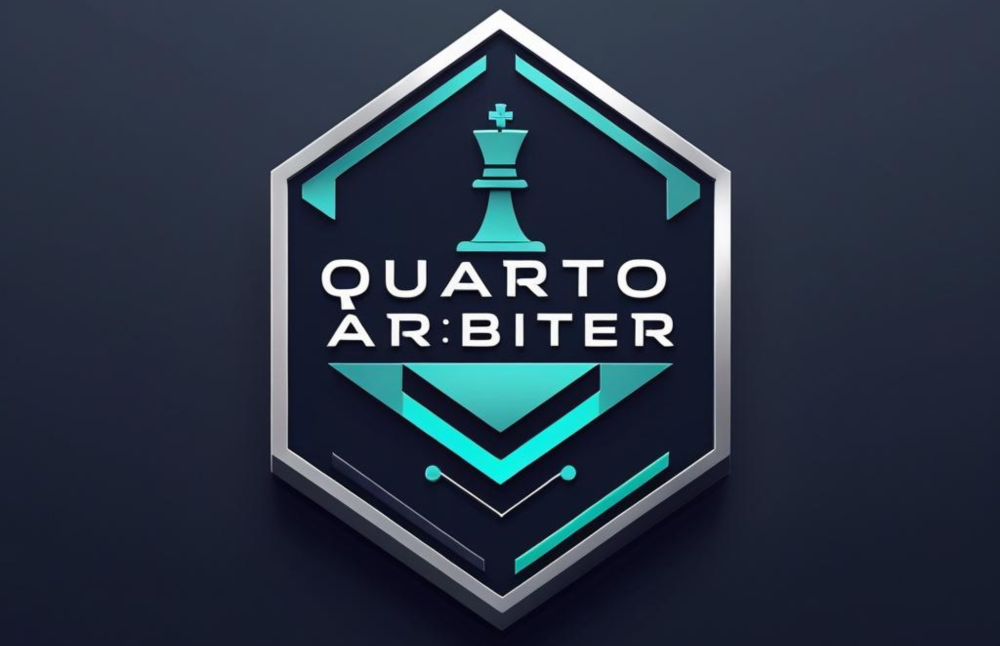

An AI-powered Quarto game assistant that plays, explains its reasoning, and teaches strategy through a multi-agent architecture combining classical game tree search with modern LLM capabilities.

## What is Quarto?

Quarto is a two-player abstract strategy game with 16 unique pieces. Each piece has four binary attributes:
- **Height:** tall or short
- **Color:** light or dark
- **Shape:** square or round
- **Top:** hollow or solid

Players take turns placing pieces on a 4x4 board. The twist: **your opponent chooses which piece you must place**. You win by completing a line of four pieces that share at least one common attribute (row, column, diagonal, or 2x2 square).

Simple rules. Deep strategy.

## Project Goals

1. Build a competent Quarto AI using classical game tree search (minimax with alpha-beta pruning)
2. Create a knowledge base of Quarto strategy for RAG-powered advice
3. Generate natural language explanations of moves and strategic principles
4. Implement a multi-agent architecture for perception, strategy, and explanation
5. Learn and have fun doing it

## Architecture

```
┌─────────────────────────────────────────────────────────────┐
│                      User Interface                         │
│  (CLI / Web UI / Photo Input)                               │
└─────────────────────────┬───────────────────────────────────┘
                          │
                          ▼
┌─────────────────────────────────────────────────────────────┐
│                    Orchestrator Agent                        │
│  Manages conversation, routes to specialists, synthesizes    │
└───────┬─────────────────┬─────────────────┬─────────────────┘
        │                 │                 │
        ▼                 ▼                 ▼
┌───────────────┐ ┌───────────────┐ ┌───────────────┐
│  Perception   │ │   Strategy    │ │  Knowledge    │
│    Agent      │ │    Agent      │ │    Agent      │
│               │ │               │ │               │
│ • Parse photo │ │ • Evaluate    │ │ • RAG over    │
│ • Validate    │ │   position    │ │   strategy    │
│   state       │ │ • Minimax     │ │   content     │
│ • Track game  │ │ • Rank moves  │ │ • Retrieve    │
│   history     │ │   + pieces    │ │   principles  │
└───────────────┘ └───────────────┘ └───────────────┘
                          │
                          ▼
                  ┌───────────────┐
                  │  Game Engine  │
                  │               │
                  │ • State mgmt  │
                  │ • Legal moves │
                  │ • Win detect  │
                  └───────────────┘
```

## Roadmap

A relaxed 12-week plan at 3-5 hours per week. Each phase produces something complete—you can stop at any checkpoint and have a working project.

---

### Phase 1: Foundation (Weeks 1-3)

**Goal:** Understand the game deeply and build the core engine.

#### Week 1: Research + Play
- [ ] Play 10+ games of Quarto (online at quarto.cc or physical)
- [ ] Pay attention to your reasoning—what makes you pick a piece, choose a square
- [ ] Read 3-4 strategy articles, take notes
- [ ] Bookmark resources for the knowledge base later
- [ ] No code yet. Just internalize the game.

**Resources:**
- [Quarto on BoardGameGeek](https://boardgamegeek.com/boardgame/681/quarto)
- [Play Quarto Online](https://quarto.cc)

#### Week 2: Game State Modeling
- [ ] Define `Piece` dataclass (4 boolean attributes)
- [ ] Define `Board` class (4x4 grid, None for empty squares)
- [ ] Define `GameState` (board, remaining pieces, current phase, selected piece)
- [ ] Implement `get_legal_placements(state)` → list of empty squares
- [ ] Implement `get_legal_piece_selections(state)` → list of remaining pieces
- [ ] Implement `make_move(state, placement, piece_to_give)` → new state
- [ ] Write unit tests for each function

#### Week 3: Win Detection + CLI
- [ ] Implement `check_winner(state)` checking:
  - [ ] Rows (4 checks)
  - [ ] Columns (4 checks)
  - [ ] Diagonals (2 checks)
  - [ ] 2x2 squares (9 checks)
- [ ] Build simple CLI: display board, input moves, play a full game
- [ ] Test by playing through several games manually

**Checkpoint:** Working Quarto game engine you can play in the terminal.

---

### Phase 2: Basic Strategy (Weeks 4-6)

**Goal:** Build an AI that plays reasonably.

#### Week 4: Position Evaluation
- [ ] Design evaluation heuristic considering:
  - [ ] Immediate wins/losses
  - [ ] "Three in a row" threats (pieces sharing an attribute)
  - [ ] Dangerous pieces in remaining pool
  - [ ] Board control / center preference (optional)
- [ ] Test heuristic on sample positions
- [ ] Tune weights based on intuition

#### Week 5: Minimax Implementation
- [ ] Implement basic minimax (no pruning)
- [ ] Handle two-phase turns (place piece, then select piece to give)
- [ ] Depth 2-3 to start
- [ ] Add `get_best_move(state, depth)` → (placement, piece_to_give)
- [ ] Play against it, observe behavior

#### Week 6: Alpha-Beta Pruning + Tuning
- [ ] Add alpha-beta pruning
- [ ] Implement move ordering (check winning moves first, etc.)
- [ ] Increase depth to 4-5
- [ ] Tune evaluation heuristic based on play
- [ ] Add timing to ensure moves complete in reasonable time

**Checkpoint:** Competent AI opponent that beats casual players.

---

### Phase 3: Knowledge Base (Weeks 7-8)

**Goal:** Build RAG infrastructure for strategy retrieval.

#### Week 7: Content Curation
- [ ] Collect 15-20 strategy resources:
  - [ ] BoardGameGeek strategy posts
  - [ ] Reddit discussions (r/boardgames, r/abstractgames)
  - [ ] Blog posts and articles
  - [ ] Academic papers (search "Quarto game theory")
- [ ] Clean and convert to markdown/text
- [ ] Tag by topic: openings, endgames, piece selection, forcing sequences

#### Week 8: Embed + Index
- [ ] Choose embedding model:
  - Option A: OpenAI `text-embedding-3-small`
  - Option B: Open source (e.g., `sentence-transformers`)
- [ ] Chunk content semantically (by concept, not fixed length)
- [ ] Set up vector store:
  - Option A: Chroma (simple, local)
  - Option B: Qdrant (more features)
  - Option C: pgvector (if you want Postgres)
- [ ] Build retrieval function: `retrieve_strategy(query, k=5)` → chunks
- [ ] Test with sample queries

**Checkpoint:** Queryable knowledge base of Quarto strategy.

---

### Phase 4: Explanation Generation (Weeks 9-10)

**Goal:** Make the AI explain its reasoning.

#### Week 9: Prompt Engineering
- [ ] Design explanation prompt with inputs:
  - Current game state (board, remaining pieces)
  - AI's recommended move and piece selection
  - Retrieved strategy content
  - Recent move history (optional)
- [ ] Output format: 2-3 sentences explaining the move
- [ ] Iterate on prompt for clarity and groundedness
- [ ] Handle edge cases (forced wins, obvious moves, complex positions)

#### Week 10: Integration
- [ ] Create `explain_move(state, move, piece)` function:
  1. Get relevant strategy from knowledge base
  2. Generate explanation via LLM
  3. Return formatted response
- [ ] Update CLI flow:
  1. Display board
  2. AI recommends move + piece
  3. AI explains reasoning with strategic principles
- [ ] Play several games, evaluate explanation quality

**Checkpoint:** AI that teaches while it plays.

---

### Phase 5: Agent Architecture (Weeks 11-12)

**Goal:** Refactor into multi-agent system with natural language interface.

#### Week 11: Agent Separation
- [ ] Define agent interfaces:
  ```python
  class StrategyAgent:
      def analyze(self, state: GameState) -> Analysis
      
  class KnowledgeAgent:
      def retrieve(self, query: str, state: GameState) -> List[Chunk]
      
  class ExplanationAgent:
      def explain(self, state: GameState, analysis: Analysis, knowledge: List[Chunk]) -> str
  ```
- [ ] Implement each agent as separate module
- [ ] Create Orchestrator that coordinates agents
- [ ] Add structured logging to trace agent interactions

#### Week 12: Conversational Interface
- [ ] Parse natural language queries:
  - "What should I do?" → full analysis
  - "Why not the tall piece?" → targeted explanation
  - "What's the theory here?" → pure knowledge retrieval
- [ ] Implement conversation state (track current game)
- [ ] Add follow-up handling ("What about B3 instead?")
- [ ] Support different interaction modes:
  - AI plays as opponent
  - AI advises on your moves
  - AI analyzes hypothetical positions

**Checkpoint:** Multi-agent conversational Quarto assistant.

---

### Phase 6: Stretch Goals (Week 13+)

No pressure. Pick what sounds fun.

#### Perception Agent
- [ ] Photo input → board state parsing
- [ ] Use vision model (GPT-4V, Claude vision, or fine-tuned classifier)
- [ ] Handle real-world conditions (lighting, angles, shadows)
- [ ] Confidence scoring and clarification requests

#### Game Memory
- [ ] Track full game history, not just current state
- [ ] Reference earlier moves in explanations
- [ ] Pattern recognition across games ("You often do X")

#### Opponent Modeling
- [ ] Track opponent's piece selection patterns
- [ ] Identify tendencies (favors certain attributes, avoids others)
- [ ] Adjust strategy based on observed behavior

#### Web UI
- [ ] Visual board with clickable squares
- [ ] Drag-and-drop piece selection
- [ ] Chat interface for explanations
- [ ] Game history sidebar

#### Play Strength
- [ ] Opening book (pre-computed good openings)
- [ ] Endgame tablebase (Quarto is small enough to solve)
- [ ] Monte Carlo Tree Search as alternative to minimax
- [ ] Self-play training for evaluation function

---

## Project Structure

```
quarto-ai-agent/
├── README.md
├── pyproject.toml
├── requirements.txt
│
├── src/
│   ├── __init__.py
│   │
│   ├── engine/                 # Core game logic
│   │   ├── __init__.py
│   │   ├── piece.py            # Piece representation
│   │   ├── board.py            # Board state
│   │   ├── game.py             # Game state and rules
│   │   └── display.py          # Board rendering
│   │
│   ├── strategy/               # AI player
│   │   ├── __init__.py
│   │   ├── evaluation.py       # Position evaluation heuristics
│   │   ├── minimax.py          # Search algorithm
│   │   └── agent.py            # Strategy agent interface
│   │
│   ├── knowledge/              # RAG system
│   │   ├── __init__.py
│   │   ├── embeddings.py       # Embedding generation
│   │   ├── store.py            # Vector store operations
│   │   ├── retrieval.py        # Query handling
│   │   └── agent.py            # Knowledge agent interface
│   │
│   ├── explanation/            # Natural language generation
│   │   ├── __init__.py
│   │   ├── prompts.py          # Prompt templates
│   │   ├── generator.py        # LLM interaction
│   │   └── agent.py            # Explanation agent interface
│   │
│   ├── orchestrator/           # Agent coordination
│   │   ├── __init__.py
│   │   ├── router.py           # Query routing
│   │   └── orchestrator.py     # Main coordinator
│   │
│   └── interface/              # User interfaces
│       ├── __init__.py
│       ├── cli.py              # Command line interface
│       └── web.py              # Web interface (stretch)
│
├── knowledge_base/             # Strategy content
│   ├── raw/                    # Original articles
│   └── processed/              # Chunked and cleaned
│
├── tests/
│   ├── test_engine.py
│   ├── test_strategy.py
│   ├── test_knowledge.py
│   └── test_integration.py
│
└── notebooks/                  # Exploration and debugging
    ├── 01_game_exploration.ipynb
    ├── 02_strategy_tuning.ipynb
    └── 03_rag_experiments.ipynb
```

## Tech Stack

### Core
- **Python 3.11+**
- **pytest** for testing
- **pydantic** for data validation

### Strategy
- Pure Python minimax implementation (no external chess/game libraries needed)

### Knowledge Base
- **Embeddings:** OpenAI `text-embedding-3-small` or `sentence-transformers`
- **Vector Store:** Chroma (local, easy setup) or Qdrant
- **Chunking:** LangChain text splitters or custom

### LLM Integration
- **OpenAI API** or **Anthropic API** for explanations
- **LangChain** or **LlamaIndex** for orchestration (optional—can DIY)

### Interface
- **Rich** for CLI formatting
- **Streamlit** for web UI (stretch goal)

## Getting Started

```bash
# Clone the repo
git clone https://github.com/yourusername/quarto-ai-agent.git
cd quarto-ai-agent

# Create virtual environment
python -m venv venv
source venv/bin/activate  # or `venv\Scripts\activate` on Windows

# Install dependencies
pip install -r requirements.txt

# Run tests
pytest

# Play against the AI (once implemented)
python -m src.interface.cli
```

## Configuration

Create a `.env` file for API keys:

```env
OPENAI_API_KEY=sk-...
# or
ANTHROPIC_API_KEY=sk-ant-...
```

## Development Philosophy

1. **No deadlines.** This is for learning and fun.
2. **Each phase is complete.** Stop anywhere and you have something working.
3. **Play the game.** Best debugging is noticing when the AI does something dumb.
4. **Don't gold-plate.** "Good enough to learn from" is the bar.
5. **Skip around.** Phases are logical order, not mandatory sequence.

## Resources

### Quarto Strategy
- [BoardGameGeek Quarto Forum](https://boardgamegeek.com/boardgame/681/quarto/forums)
- [Quarto Strategy Guide (BGG)](https://boardgamegeek.com/thread/...)
- Academic: "Solving Quarto" papers on Google Scholar

### Technical
- [Minimax Algorithm Explained](https://www.youtube.com/watch?v=l-hh51ncgDI)
- [Alpha-Beta Pruning](https://www.chessprogramming.org/Alpha-Beta)
- [RAG from Scratch](https://github.com/langchain-ai/rag-from-scratch)
- [Building LLM Agents](https://www.deeplearning.ai/short-courses/)

## License

MIT

## Acknowledgments

- Blaise Müller for creating Quarto
- The BoardGameGeek community for strategy discussions
- You, for building something cool